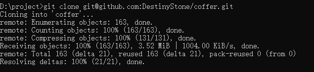
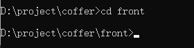
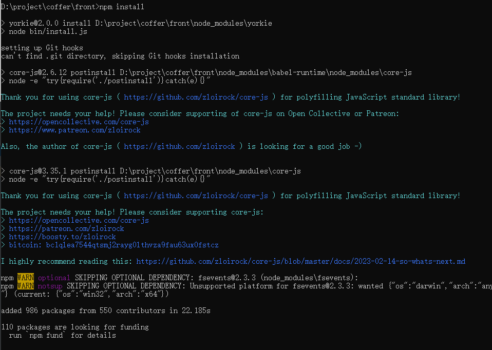
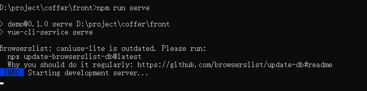
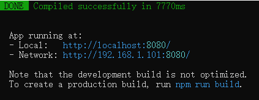
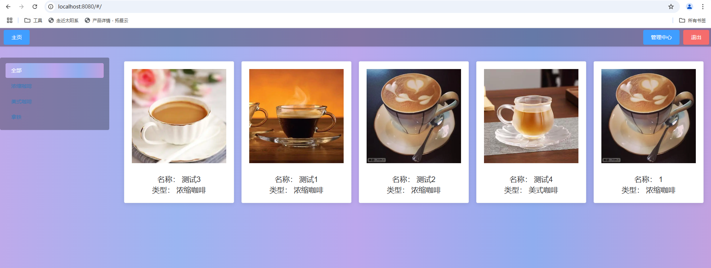
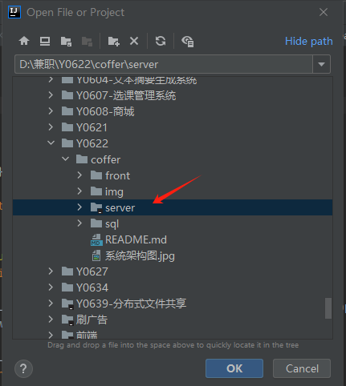
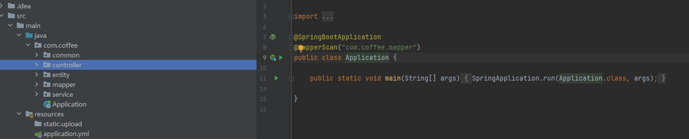
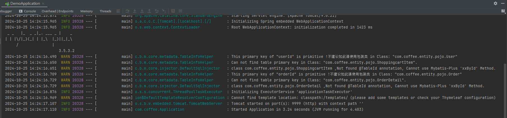

# 系统环境要求
+ jdk: 1.8
+ node: v12.16.3
+ mysql: 8.1.2
+ idea: 2022.2.3

# 项目运行、测试和部署

## 前端项目
1. git clone 将项目部署至本地
   ```shell
   git clone git@github.com:DestinyStone/coffer.git
   ```
   
2. 项目根目录下打开cmd, 使用 cd 进入前端目录
   ```shell
   cd front
   ```
   
3. npm install 安装项目依赖
      ```shell
   npm install
   ```
   
4. npm run server 运行项目
   ```shell
   npm run server
   ```
   
   
5. 访问 http://127.0.0.1:8080 测试项目是否正常
   
## 后端项目
1. git clone 将项目部署至本地
   ```shell
   git clone git@github.com:DestinyStone/coffer.git
   ```
   
2. 使用idea打开项目，等待maven依赖安装完毕

   
4. 启动DemoApplication类运行项目
   
   
   
5. 查看idea控制台，检查项目是否正常运行
   
   

